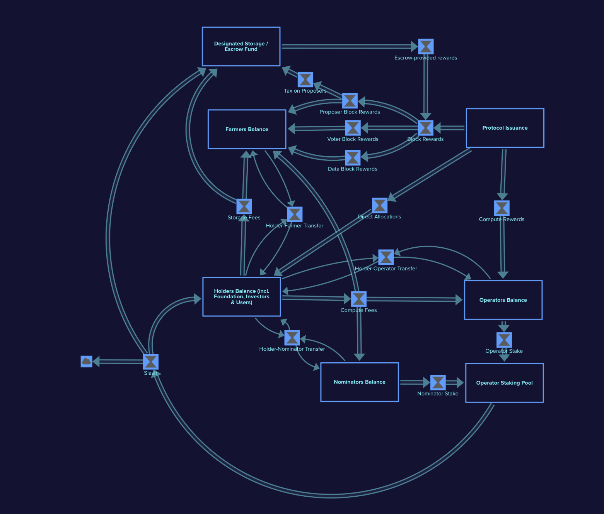

# The Subspace Network Economic Digital Twin 

A cadCAD Design Digital Twin for Subspace Network Economic Dynamics.


*A stock and flow description for SSC on the tokenomics of Subspace. This model uses this as the departure point for the dynamics being simulated.*

## Table of Contents
1. [Table of Contents](#table-of-contents)
2. [Quick Start Guide](#quick-start-guide)
3. [Introduction](#introduction)
4. [Background](#background)
5. [Methodology](#methodology)
6. [Analysis Results](#analysis-results)
7. [Advanced Usage](#advanced-usage)
8. [Additional Resources](#additional-resources)


## Quick Start Guide

### Installation

**1. Install System Requirements:**
- [>= Python 3.6](https://www.python.org/downloads/) 
- One of [`venv`](https://docs.python.org/3/library/venv.html) or [`poetry`](https://python-poetry.org/) for python virtual environment.

**2. Clone the Repository:**
```bash
git clone https://github.com/blockscience/subspace && cd subspace
```

**3. Activate Python Virtual Environment:**

**Option 1**: Using `venv` virtual environment
```bash
# Create a virtual environment
python -m venv venv

# Activate the virtual environment
source venv/bin/activate

# Install dependencies
pip install -r requirements.txt

# If you want to deactivate the virtual environment
deactivate
```

**Option 2**: Using python poetry
```bash
# Install dependencis
poetry install

# Activate the poetry shell
poetry shell

# To exit the poetry shell
exit
```

### Usage
Inside of the `subspace/` package directory and inside of
your python virtual environment.

**Run tests:** 
```bash
pytest
```

**Get Help on Available Options:**  
```bash
python -m subspace_model --help
```

```
Usage: python -m subspace_model [OPTIONS]

Options:
  -e, --experiment [sanity_check_run|psuu]
                                  Select an experiment to run.
  -p, --pickle                    Pickle results to data/simulations/.
  -a, --run-all                   Run all experiments.
  -s, --samples INTEGER           Set Sample size; if not set runs default
                                  sample size.
  -d, --days INTEGER              Number of simulation days.
  -sw, --sweep_samples INTEGER    Number of sweep combinations to sample (if
                                  applicable for the experiment)
  --help                          Show this message and exit.
```

**Example 1:**
Run the sanity check simulation and save results:
```bash
python -m subspace_model -e sanity_check_run -p 
```

**Example 2:** Generate a PSuU Dataset with 2 Monte Carlo runs and 2 parameter subsets and save the results
```bash
python -m subspace_model -e psuu -s 2 -sw 2 -p
```

**Analyze Simulation Results in Jupyter:**  
```bash
jupyter lab
```


## Introduction

### Economic Modeling with cadCAD

Complex Adaptive Dynamics Computer-Aided Design (cadCAD) is a python based
modeling framework for modeling, simulation, and validation of complex systems
designs.

Given a model of a complex system, cadCAD can simulate the impact that a set of
actions might have on it. This helps users make informed, rigorously tested
decisions on how best to modify or interact with the system in order to achieve
their goals. cadCAD supports different system modeling approaches and can be
easily integrated with common empirical data science workflows. Monte Carlo
methods, A/B testing, and parameter sweeping features are natively supported.

For more information on cadCAD:

- https://community.cadcad.org/t/introduction-to-cadcad/15
- https://community.cadcad.org/t/putting-cadcad-in-context/19
- https://github.com/cadCAD-org/demos


### The Subspace Economic Model

The Subspace Economic Model is a Digital Twin Stock & Flow representation for the SSC token dynamics as they flow through Subspace's distinct mechanisms. The parameters, mechanisms and their constituent logic are based on The Subnomicon and Token Economics design documents provided by the Subspace Team. 

The digital twin is implemented as a python software package that enables data
generation and analysis using cadcad and other python libraries. Model
construction and data generation are performed using cadCAD. Research analysis
is performed using python data analysis pipelines and machine learning for the
purpose of selecting configuration parameters that increase the likelihood of
achieving desired goals.

Balances on the system are split across economic sectors of interest, each one with distinct admissible actions: 
- Farmers
- Operators 
- Nominators
- Holders


### Structure of the Model

The Subspace Network's economic model is built using cadCAD and is composed of the
following python modules:

| Python Module | Purpose |
|:--------|:--------|
|  [types.py](subspace_model/types.py)  |  Type definitions for the model state and parameters.  |
|  [const.py](subspace_model/const.py)  |  System constants  |
|  [params.py](subspace_model/params.py)  |  System parameters, environmental parameters, and governance surface.  |
|  [state.py](subspace_model/state.py)  |  System inital state.  |
|  [logic.py](subspace_model/logic.py)  |  Policy and state update logic. |
|  [structure.py](subspace_model/structure.py)  |  The block update structure of the model.  |
|  [\_\_main\_\_.py](subspace_model/__main__.py)  |  The command line interface to the subspace model.  |
|  [experiments/experiment.py](subspace_model/experiments/experiment.py)  |  Defines experiments such as standard run and psuu.  |
|  [experiments/logic.py](subspace_model/experiments/logic.py)  |  Behavioral and mechanism logic for experiments.  |
|  [psuu/](subspace_model/psuu/)  |  Pipeline components for analyzing PSuU datasets.  |


## Background

### Subspace

> Subspace is the first layer-one blockchain that can fully resolve the
> blockchain trilemma. Subspace is built from first principles to
> simultaneously achieve scalability, security and decentralization. At its core,
> Subspace introduces a novel storage-based consensus protocol that separates
> consensus from execution. This proposer-builder separation allows Subspace to
> independently scale transaction throughput and storage requirements while
> maintaining a fully decentralized blockchain. 

-[Subspace Subnomicon](https://subnomicon.subspace.network/docs/intro)

### Aligning Incentives for Optimal Scalability

> Subspace includes a novel algorithm to dynamically adjust the cost of
> blockspace in response to changes in supply and demand to economically secure
> the network in an open environment. Such adjustment naturally keeps the network
> incentive compatible for farmers, providing storage and data availability
> bandwidth and for operators providing raw compute power.
> 
> Subspace creates the world's first two-sided marketplace for blockspace,
> allowing it to have a dynamic on-chain cost-of-blockspace and a stable
> off-chain price-of-blockspace without relying on centralized control or
> coordination. On one side are the farmers, who collectively supply blockspace
> bandwidth through their storage of the blockchain history. On the other side
> are dApp developers and users, who demand blockspace to deploy and run their
> applications. Subspace's marketplace algorithm adjusts the on-chain
> cost-of-blockspace paid out to farmers based on real-time supply and demand.
> When demand is high, the cost rises to incentivize more farmers to join. When
> demand is low, the cost falls to disincentivize over-investment in storage.
> This dynamic adjustment process occurs transparently on-chain through the
> protocol rules.
> 
> When combined with existing scalability frameworks, Subspace can achieve linear
> scaling of the blockspace as more nodes join the network without sacrificing
> security or decentralization.

-[Subspace Subnomicon](https://subnomicon.subspace.network/docs/advancements#aligning-incentives-for-optimal-scalability)


### Terminology
- **Fees**: The payments for transactions on the network.
- **Rewards**: The compensation for the work performed by the participants of the network via the issuance of the newly minted tokens by the protocol.
- **Issuance:** The amount of tokens minted as a Reward per block, total for all recipients.
- **Proposer:** Farmer who won the block solution challenge.
- **Voter**: Farmer who won the vote solution challenge. The current ratio is, on average, 9 votes per block.

For additional terminology, please refer to the [terminology section of the subnomicon](https://subnomicon.subspace.network/docs/terminology/).

### Recommended Readings from the Subnomicon
- [Architecture Overview](https://subnomicon.subspace.network/docs/overview)
- [Advancing Blockchain](https://subnomicon.subspace.network/docs/advancements)
- [Consensus](https://subnomicon.subspace.network/docs/category/consensus)
- [Network Architecture](https://subnomicon.subspace.network/docs/category/network-architecture)
- [Decoupled Execution](https://subnomicon.subspace.network/docs/category/decoupled-execution)
- [Staking](https://subnomicon.subspace.network/docs/decex/staking)
- [Rewards and Fees](https://subnomicon.subspace.network/docs/rewards_fees)

## Methodology

For further information on the methodology used in this work, please refer to the [Subspace PSUU Work Plan Methodology Document](resources/subspace-psuu-work-plan-methodology.md).

## Analysis Results

The following notebooks highlight the results of the subspace parameter selection research phase: 
| Notebook | Purpose |
|:--------|:--------|
|  [PSuU Analysis](notebooks/workflows/psuu.ipynb)  |  This notebook showcases the PSuU methodology workflow to produce parameter selection decision trees from the trajectory tensor.  |
|  [PSuU Single Run Analysis](notebooks/research)  |  This notebook explores a single run from the PSuU timestep tensor.  |
|  [Sanity Check Run](notebooks/per-experiment/01-santity_check_run.ipynb)  |  This notebook explores the state trajectory of a single run with default parameters.  |


For a fully comprehensive review of research and analysis, see the following sections in the [notebooks](notebooks) directory:

| Analysis Section | Purpose |
|:--------|:--------|
|  [Exploratory](notebooks/exploratory)  |  A set of notebooks that perform exploratory analysis on simulation results.  |
|  [Per-Experiment](notebooks/per-experiment)  |  A set of templated notebooks that correspond to a series of experiments designed throughout the research phase of this project. The notebooks in this directory correspond to the functions found in [experiment.py](subspace_model/experiments/experiment.py).  |
|  [Research](notebooks/research)  |  A set of notebooks that perform verification, validation, and benchmarking of specific components of the system.  |
|  [Workflows](notebooks/workflows)  |  A set of notebooks that showcase the parameter selection under uncertainty (PSuU) workflows.  |


For a complete overview of the parameter selection research phase, please see the [Subspace Subspace Parameter Selection Report](resources/subspace-parameter-selection-report.md).


## Advanced Usage
- Modifying Default State
- Modifying Default Parameters
- Modifying Controllable Parameters
- Modifying Environmental Scenarios

## Additional Resources
- [Subspace Work Plan Methodology](resources/subspace-psuu-work-plan-methodology.md)
- [Subpace Parameter Selection Report](resources/subspace-parameter-selection-report.pdf)
- [The Subnomicon](https://subnomicon.subspace.network/docs/intro)

