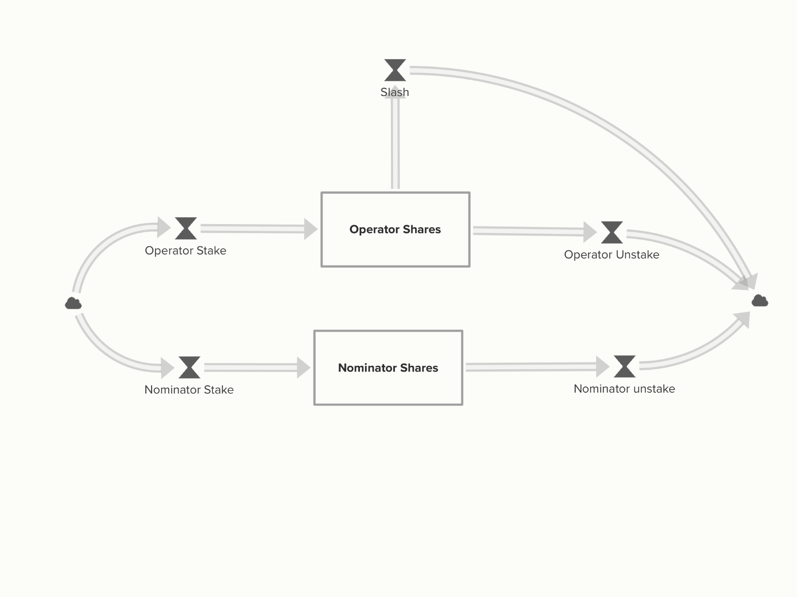

# The Subspace Network Economic Digital Twin 

A cadCAD Design Digital Twin for Subspace Network Economic Dynamics.


*A stock and flow description for SSC on the tokeconomics of Subspace. This model uses this as the departure point for the dynamics being simulated.*


*A stock and flow description for Staking Pool Shares*

## Notes on modelling

This Digital Twin is a Stock & Flow representation for the SSC token dynamics as they
flow through Subspace's distinct mechanisms. Balances on the system are split
across economic sectors of interest: Farmers, Operators, Nominators and Holders,
each one with distinct admissible actions.

The parameters, mechanisms and their constituint logic were based mainly on 
Subnomicon and Token Economics design documents that were provided. Several
assumptions were required to be done, and they're indicated with `XXX` tags
through this repo.

## How to run it

- Option 1 (CLI): Just pass `python -m subspace_model`
This will generate an pickled file at `data/simulations/` using the default single run
system parameters & initial state.
    - To perform a multiple run, pass `python -m subspace_model -e`
- Option 2 (cadCAD-tools easy run method): Import the objects at `subspace_model/__init__.py`
and use them as arguments to the `cadCAD_tools.execution.easy_run` method. Refer to `subspace_model/__main__.py` to an example.

## File structure

```
├── notebooks
│   ├── fund_inclusion.ipynb
│   ├── issuance_sweep.ipynb
│   ├── reward_split_sweep.ipynb
│   ├── sanity_check.ipynb
│   └── standard_stochastic.ipynb
├── README.md
├── requirements.txt
├── resources
│   ├── shares-stock-flow.png
│   └── ssc-stock-flow.png
└── subspace_model
    ├── __init__.py
    ├── __main__.py
│   ├── experiment.py
│   ├── logic.py
│   ├── params.py
│   ├── structure.py 
│   └── types.py
    ├── const.py
    ├── metrics.py
    ├── trajectory_metrics.py 
```

Digital twin python modules.
    
| Python Module | Purpose |
|:--------|:--------|
|  [experiment.py](subspace_model/experiment.py)  |  Code for running experiments, parameter sweeps, and scenario planning.  |
|  [logic.py](subspace_model/logic.py)  |  All logic for substeps of blocks. Informs how state is mutated.  |
|  [params.py](subspace_model/params.py)  |  System parameters, initial state, and standard parameters.  |
|  [structure.py](subspace_model/structure.py)  |  The model structure as a netlist that wires state update blocks.  |
|  [types.py](subspace_model/types.py)  |  Type definitions for the model state and parameters.  |
|  [const.py](subspace_model/const.py)  |  System constants  |
|  [metrics.py](subspace_model/metrics.py)  |  System metrics  |
|  [trajectory_metrics.py](subspace_model/trajectory_metrics.py)  |  Metrics that require trajectory dataset.  |


## What is cadCAD
cadCAD (complex adaptive dynamics Computer-Aided Design) is a python based modeling framework for research, validation, and Computer Aided Design of complex systems. Given a model of a complex system, cadCAD can simulate the impact that a set of actions might have on it. This helps users make informed, rigorously tested decisions on how best to modify or interact with the system in order to achieve their goals. cadCAD supports different system modeling approaches and can be easily integrated with common empirical data science workflows. Monte Carlo methods, A/B testing and parameter sweeping features are natively supported and optimized for.

For more information on cadCAD:

* https://community.cadcad.org/t/introduction-to-cadcad/15
* https://community.cadcad.org/t/putting-cadcad-in-context/19
* https://github.com/cadCAD-org/demos


## Installing cadCAD for running this repo

### 1. Pre-installation Virtual Environments with [`venv`](https://docs.python.org/3/library/venv.html) (Optional):
It's a good package managing practice to create an easy to use virtual environment to install cadCAD. You can use the built in `venv` package.

***Create** a virtual environment:*
```bash
$ python3 -m venv ~/cadcad
```

***Activate** an existing virtual environment:*
```bash
$ source ~/cadcad/bin/activate
(cadcad) $
```

***Deactivate** virtual environment:*
```bash
(cadcad) $ deactivate
$
```

### 2. Installation: 
Requires [>= Python 3.6](https://www.python.org/downloads/) 

**Install Using [pip](https://pypi.org/project/cadCAD/)** 
```bash
$ pip3 install cadcad==0.4.28
```

**Install all packages with requirement.txt**
```bash
$ pip3 install -r requirements.txt
